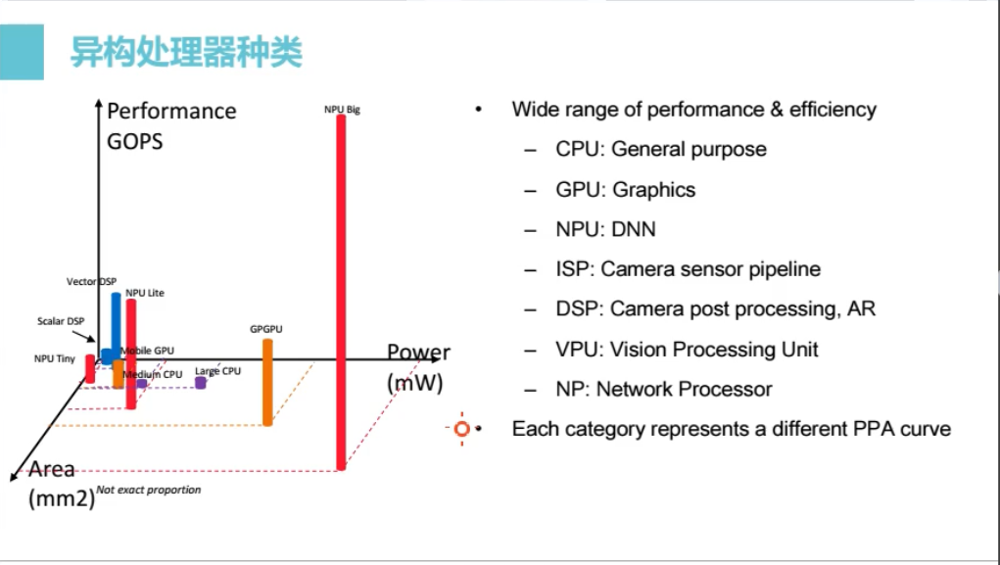
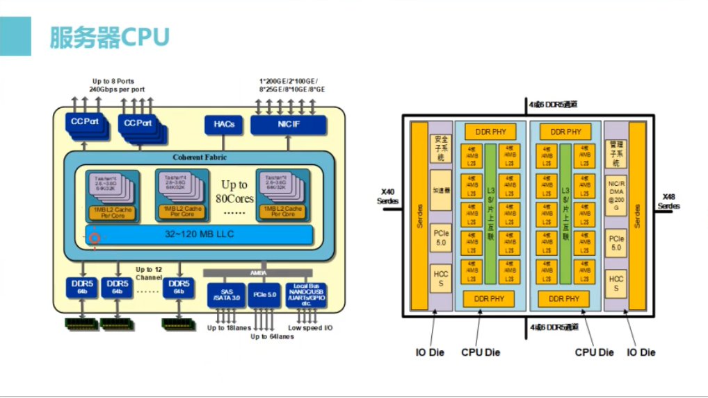
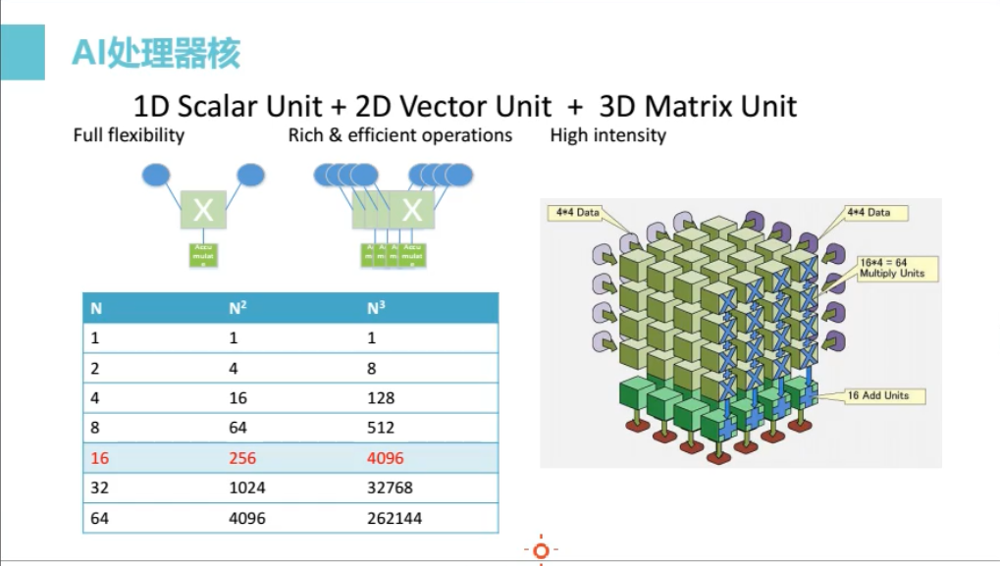
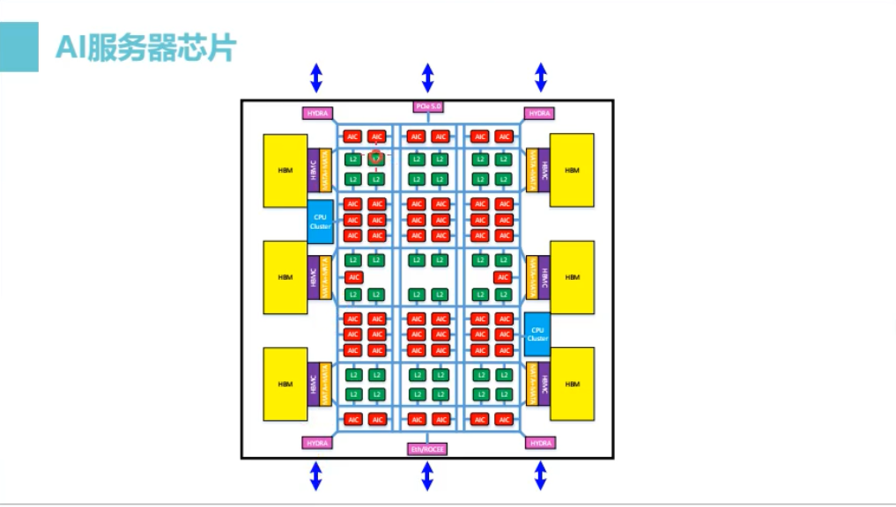
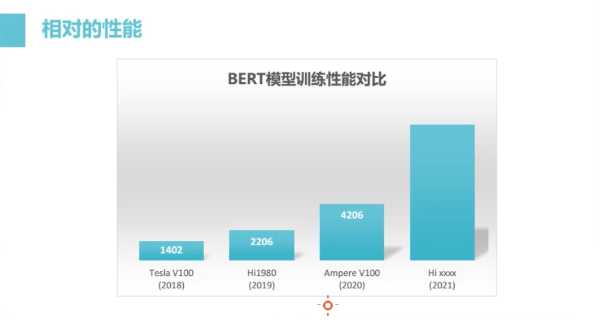
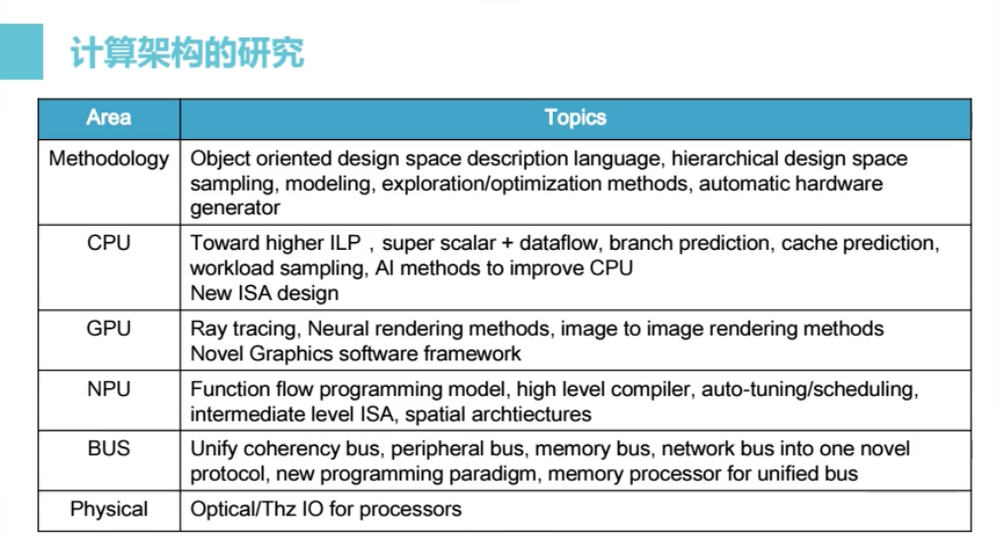
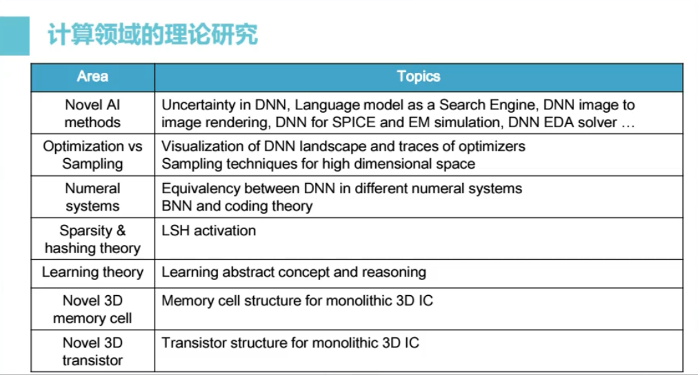
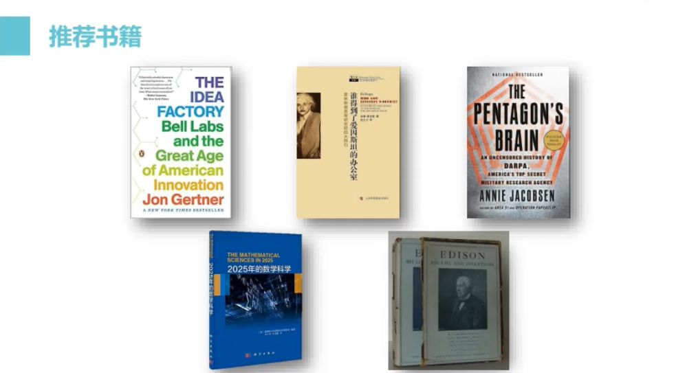

**1:30:00 ---- 最后。以ppt为索引**

**开始时间：1:30:00**

当我们去追去极致的性能、功耗和面积，也就是实现芯片上的一种权衡的话，我们把它画在这个三维空间里头我们就能发现，这些点是相当离散的。而且根据应用的诉求，我可能在某些应用里头就有一个固定的功耗约束，硬的功耗约束是不能够超越的。比如说一个基站要挂在室外的环境里头，要有10年的寿命，那这个基站就一定不能有风扇给它散热，因此你就有一个散热的上限，这个上限就会转移成一个对处理器功耗的一个上限。那么在这些困难的工程问题面前，其实是逼迫大家使用了异构的建构，使得解决一个具体的问题时实现了足够好的效率。但是我想说的是DSA提出了一个不一样的观点，就是说我不认为DSA是一个黄金的时代，它是一个有效的科学方法。原因就是回到我刚才讲的那个，任何一个计算架构，背后所需要支撑它的软件体系的建立是需要巨大的投入和克服巨大的困难的。因此任何一个架构，它之所以可以长期存在，具有一定的持续的生命力，它一定要有足够的规模，就是它的产业规模因此要比较大。所以我刚才才专门把前面这三类我们认为是属于普适性的架构**(图中CPU, GPU, NPU)**专门地提出来，作为我们的重中之重。那稍微给大家一些具体的例子来看一下。

**开始时间1:31:57**

比如说这个是一个服务器等级的CPU，大致的你可以看到这里有很多高性能的处理器核。这个数量其实现在在单片里头就已经达到了八、九十甚至上百个的规模。而这个处理器核，由于它们是冯诺伊曼架构，它们都需要通过对外存的访问来实现一个复杂程序的功能。因此这个外存的通道数一定要足够的多(左图最左下方)，来支撑处理器对这些外部的Memory的访问。其实所有的架构里头都面临一个存储墙的问题，也就是说Memory不够快，跟不上内部的处理器核的性能，怎么办？其实过去的二三十年是一直在试图求解这个问题。我们看右边这个图可能就会更加明显一点，就会看到我们这个处理器核里头，放了很多很复杂的分布式的Cache，和很复杂的互联系统。这个Cache的目的其实是通过片内的一级一级的数据复用，来降低对外存的压力。我刚才说我们可能处在一个所谓的第一阵营，就是说我们不管是在指标，还是在架构的类型，还是工程实现的边界上面和领先的厂家都是非常类似的。我相信这种差距不会超过一年的gap。那么大家采用的手段以及工程方法都非常的类似。当然这个处理器除了CPU本身之外还有很多的重要的外设，连磁盘、连PCI、连网络接口，然后多个芯片之间实现横向扩展的多片互联的这些接口，等等。这就是相当于现代处理器的一个典型的架构。这个架构目前还有一个很明显的趋势，就是当你这个芯片越做越大的时候，你会碰到各种各样的物理边界。因此我们可能是世界上最早采用这种chip lat(没听懂，1:34:32处)的方式，来完成这种处理器的物理实现。也就是说逻辑上它是一个这样的Unified体系，但是物理上我可能把它切成两半，切成三瓣，切成四瓣，这样的话使得我没一个die的尺寸在一个比较优化的范围之内，这样生产的良率会比较高。而且我也可以实现更大规模的总的核数，就是包括一些高速的接口可以用一些不一样的工艺来实现。那么这些好处，实际上在过去的四五年吧，都是在我们的产品领域得到充分的实践证明的。我们可看到其他的处理器厂家也开始走向类似的路径。

**开始时间：1:35:28**

然后我稍微提一下这个AI处理器核，可能并没有时间讲特别的细。但是我想提出一个非常重要的要点，这个也是我们在设计、生成这个AI处理器里头，可以说是一个非常重要的出发点。就是我们发现在AI的深度网络里头，有大量的这个矩阵类的运算，包括卷积、矩阵类的相乘或者矩阵乘向量这样的。那么这个呢我们成为blas3(?)，就是说如果我把它看作是一个线性代数的问题的话，他是一个3阶线性代数的问题。从计算次数的总量，如果我们算它的乘法和加法的次数来说，这个blas3占了绝对的统治性的地位。比如说典型的网络都占了98%、99%这样的比例了。那么什么叫blas3呢，比如说我们把一个输入看成是一个矩阵，N作为这个方形矩阵的边长的话，那么它完成里面的某一个运算，比如说一个乘法，那么它完成这个运算所需要使用输入的数据运算的次数是N立方次，而它访存去这个操作数是N平方次。这是一个非常重要的特性，因为当N从2的幂递增时，我们就能发现，如果我选择一个矩阵单元，是专门处理16x16这样的数据的话呢，我首先获得了4096次乘法和4096次加法，那这一个运算就要有8192的并行度，计算的并行度。另外一个重要的特点是，它所消耗的最内层的访存带宽却只有它的1/16，也就是256，我只要取256个数据就能进行8192次运算。这个数据也是非常关键的，因为这个缩小的比例直接就决定了我们刚才说的那个存储墙的问题。因为这些核的运算，它会对这个访存直接带来压力，但是由于这个运算是三阶的运算，它天生就不需要访问那么多内存。而如果你用一个不管是GPU架构，或者是CPU架构呢，由于它在设计的时候没有考虑到这个三阶运算的特点，它势必做多少次运算就要取多少个操作数，这两个数字是一样的，并没有降低访存压力的特性。因此就是说由此出发吧，我们建立了一整个计算体系。当然它有三阶运算也有两阶运算也有一阶运算，他们之间用一种合理的配比，把它组合在一起。这就是我们称之为AI处理器的一个recipe。

**开始时间：1:39:14**

那么这个芯片大概就是我们正在做的最新的AI服务器的芯片。首先就是说里面有很多这个红色的就是刚才说的三阶混合的AI处理器核。然后里面也有相当复杂的Cache层次，这是因为从AI处理器核到外存的访问，它有巨大的缩放比。就是说我从这个处理器核产生的访存的压力，对带宽需求，可能是这些Memory接口所能提供的带宽能力的2000倍以上。因此我需要通过一个复杂的存储层次，一层一层的使得数据复用，这样的话就使得靠外层，就是靠DRAM的这一层，它的带宽，就是说以10倍10倍地往下减，最后到了DRAM，最后实现2000倍或者3000倍的带宽的缩减。这个基本上是AI服务器芯片的设计思路吧。当然在这里面有非常多的物理边界，因为当我们实现了如此高密度的计算能力的时候它会耗电、会发热，而且我们需要提供非常高的带宽需要用最先进的HBM的高速的Memory，而且需要把它们封装在同一个封装里面。这里面包括非常多的供电，如果是一个四五百瓦的芯片在这么小的面积里头，要供进去的电流都是几百安培的电流。这些都是工程上面非常具有挑战性的。当然我们并不是独特面临这些挑战的人，我们刚才提到的，比如GPU这些最新的产品，他们面临的挑战也是极其类似的吧，所以大家也只能类似八仙过海，各显神通，各自找到最好的解决办法，来把这些工程问题克服了。

**开始时间：1:41:35**

然后这个是我们芯片的物理架构的示意图吧。就是物理上你会看到这个芯片的什么东西呢，首先是这个SOC的die，这个蓝颜色的一部分。我们为了突破这个存储墙呢，可能会率先使用这个3D SRAM，通过3D贴合的方式，把这个逻辑die贴在大容量SRAM上面，实现更高更大容量的Cache。这些边上房子一样的块块可能就是一些配合它的HBM或者是一些I/O部件。

**开始时间：1:42:46**

那我们刚才提到说，我们可能在各自的领域里面属于一种交替领先，需要持续努力才能stay in the game，这么一种局面。我就拿AI处理器这个领域来作一个例子。图中V100是18年发布的最大的GPU，19年的Hi1980是它的1.6到1.7倍，20年，也就是两周前发布的Ampere V100芯片又把某一个具体任务的性能进一步提升。我们预期的下一步肯定再是它的两三倍，这样的话这个交替才能持续下去。我想说的是，这些领域都代表着科技领域中最最激烈的一种竞争，而且我们在这个过程中是完全不能够懈怠的，需要付出最大的努力，才能够哪怕是跟上这个节奏。但是所幸的是说，通过过去这些年的积累，至少我们逐渐地建立了在这个赛道上一直保持参赛甚至取得局部领先的能力。

**开始时间：1:44:34**

刚才讲到工业界做研究的不同层次，因为刚刚讲到的是给大家展示的一系列产品的范例。那么为了支撑这些持续的竞争，我们需要做很多架构的研究。你可以认为这些架构研究很多还是偏工程的，比如说我随便举几个例子，比如说我涉及到这个Methodology，这个设计方法上面，我们就一直在思考这样一个问题，如果大家都是有同样一个设计目标，去做下一代的CPU也好GPU也好还是AI处理器，如果大家的能力、资源都是相当的，我们怎么可能在这个比赛当中胜出呢？因此我们就有一个很强烈的动机，就是要在这个设计方法上更加聪明地去参与这个赛跑，也就是说如果别人是在跑步，我们骑摩托车，我们就可能会比较容易地胜出。这个意味着什么呢，如果你到芯片设计领域你会发现，我们常用的芯片设计方法、数字芯片设计方法就是用VHDL、verilog这种语言来描述的。描述一个设计，逻辑中和物理实现，这些设计方法如果都是一样的话，你会发现如果做一代处理器大概需要2年的时间。因为你首先要花很长的时间决定架构的改进，包括引入什么样新的算法、新的体系结构，你需要取权衡各种体系结构的收益。最后决定一个设计的spec(?)，然后再花时间把他设计验证以及物理实现。这个周期就是大概1年半到2年的时间。其实像刚才说的，大家都用同样的方式赛跑，胜出的概率并不大。但是如果我们从软件行业吸取一些有效的经验，我们就会发现verilog编程的层次，大致对应于C语言吧，也许比C更加底层一点点。但是我们现在从业的程序员里头，我相信用C语言来编程的软件人员已经是非常少的，也许不会到10%的人。90%的人在过去的20年里头都转向了越来越抽象，越来越高级、更加友好的或者说生产效率更高的编程语言、编程方法。那么这个方法对于我们是非常具有借鉴意义的，因此我们非常希望在设计方法上就实现突破。比如我们在实现一个加法器、一个乘法器或者一个Cache，我们就不应该把它设计成一个固化的东西，而是应该把它看作是一类东西，我应该描述这一类东西的设计空间是什么。首先一个加法器可能有位宽的不同，有流水线深度的不同，或者是有很多其他的变种，有各种实现乘法器不同的架构的方法。如果我们把它看作是一个Object，然后把它封装在一个弹性的Object里面的话，这时当我去做一个高层的设计的时候实际上是一个搭积木的过程，我是在库里头把各种有弹性的零件组合在一起，那么这个时候这个芯片的优化就变成了一个数学的问题。因为我们描述的是一个有层次的、有弹性的设计空间，而我的设计目标是在给定的物理约束，比如说我需要多大的面积啊，最大功耗不能超过多少啊，等等，在这些基础上探索最高性能的求解。如果是做AI的同学可能就会很熟悉这个优化的问题，在多维、高维空间中进行探索、进行采样、进行优化的问题。那我们实际上就是正在做这方面的研究吧。当然这些研究会有很多相关的问题，包括是不是要发明新的设计语言，是不是要发明新的代码仓的管理方式，以及在数学方法上如何使用最少的采样得出最精确的prediction，如何去做多目标帕累托优化。如果有一些机器学习或者优化问题等数学背景的同学可能就会感觉对这些问题并不陌生。比如CPU这个领域，在过去的20年一直是在指令集并行这个ILP(Instruction Level Parallelism)，整个CPU的设计就是想要把一个通用的程序每个周期在上面多执行其中的几条指令，就是Instruction (?1：50：30处)这个指标尽可能地提升。因此引入了非常复杂的super scalar，就是超标量结构、分支预测等等这一系列方法，目的是为了提升ILP。但是我们发现，在处理器的眼镜(?1:50:50处)当中，进一步提升ILP的收益是越来越少的了。比如说在两代的处理器的设计当中，我们会发现，我可能用了70%的面积的增加，1.7倍的设计的尺寸，可能只换来了30%的性能提升，也就是说越来越接近饱和曲线，可能到了一个程度就是说继续加大投入的资源，已经不能取得性能的提升。所以这也是为什么我们看到不管是我们自己还是业界里头几乎所有处理器，单核性能的提升已经放的非常非常的慢了。那这个时候我们就必须要提出一些问题就是说，超标量这种方法是不是就是唯一的方法，我们是不是需要试图去寻找一些新的并行的模式。就像GPU从指令集并行到线程级并行，因此实现了上百倍的性能提升。那么我们就算是在指令集中，是不是有新的方法，有没有机会去引进一些混合式的架构，比如说超标量和数据流之间做一定的混合，来实现更高的指令级并行，或者实现显著的能效的提升。所以这些问题看上去非常经典，而且也不是学术界非常热门的研究话题，但是在我们工业界中，这些经典问题仍然是非常值得研究的。(受时间限制其他图中其他领域跳过)

**开始时间：1:52:50**

然后有关计算领域的理论研究，我们也认识到是有非常深远的现实意义。因为刚才讲之前提到的三个通用的计算模式：CPU、GPU、NPU，其实是代表了三大类数学方法，这三大类数学方法其实是完全不一样的。因此我们认为新的数学方法的发现会直接影响到最优的计算架构，甚至会催生新的计算模式。这些所谓计算领域的问题，可能很多都是和AI相关的。比如我们现在需要去研究深度学习网络里头的icertenty(?)或者是置信度，或者是决策的confidence level这样的度量。我们可能期待看到语言模型实现比较好的突破的时候，我们会期待在语言模型上是不是能学到更抽象的概念以及概念之间的关系。它这个语言看上去已经是一种比较初级的概念，现在统计的方法看上去已经在语言领域实现了巨大的突破。我们如果回顾十几年前，我相信几乎所有的AI学者都认为机器翻译或者阅读理解这种问题是不可能突破的，因为过去的方法，尤其是符号主义的方法，常年都卡在那里。但是现在用统计的方法，由于巨大算力的出现，尤其是最新的GPT3，号称训练一次要耗掉1000万美金的电费，这是一个非常恐怖的海量运算，但是这些方法我更关系它背后的数学原理。如果语言代表了一种很基础的知识，在此之上是否有机会实现更高的概念的学习，等等。以及机器学习到的概念和人类所建立的概念体系之间如何建立连接，这些问题都是非常fundamental的问题。因此我们就在想如果去看大家每天都在用的搜索引擎，它是否可以从阅读理解、语言处理的角度来实现突破呢？而不是类似关键字索引，关键字索引是过去的搜索引擎最基础的核心。但如果设想一个AI模型，它阅读理解的速度很快，一天可以把全世界的网页都阅读了，它是否可以通过对话的方式直接回答提问者的问题，而不是给你一些相关的页面。这些都既有现实的巨大潜力，也有非常深远的理论突破的期待。比如用深度网络来做PDE——就是大规模科学问题的求解，包括用AI来做图像的渲染，而不是通过3D建模的方法。其实每一个领域都代表了，虽然是来自于某一些应用的场景，它背后可能都有相当深厚的数学原理。当然说到AI肯定逃不了优化的问题和采样的问题。虽然AI的学者非常的多，但是真正深入到背后的数学基础的人数，我们觉得还是不够的，或者说大家对这些问题，直到现在依然没有很好地突破。比如说如果我们把一个1000亿维的AI模型看作是一个高维的流行曲面。而你训练的过程是在这个曲面上寻找极值，全局的最小。我们其实对这种高维的空间，它长什么样，什么形态，它的数学性质，了解其实是甚少的，甚至没有度量的方法，没有可视化的方法，或者说这些方法都处在非常低级的阶段。因此我觉得当我们在使用深度学习或者在研究深度学习的问题的时候，就非常期待就是说大家不要满足于做实验科学家，需要有理论科学家去思考这些问题。不要满足于某一个问题可以刷榜，而是要去思考为什么可以刷榜，其背后的数学本质和数学方法是什么。当然刚才提到采样，采样和优化是两种非常不一样的，虽然是关联的，但是是两种完全不同的数学工具。那么如果我们把它看作是一个高维空间的优化问题，似乎直觉上使用梯度去寻优，那是不是最好的方法呢？那是不是用采样的方法在更大范围更聪明地去对这个landscape的形态做一些更加全局的知识，来帮助指导这个寻优的过程，是更加有效的呢？这些工作虽然是来源于不同的领域，但它们都是相关的，而且背后的数学问题也非常值得研究。

**开始时间：1:59:46**

最后，有关我刚刚分享的
如何做研究的思路也来源于这些书本，我就把它们放在这里以供同学们参考。其中这个The Idea Factory就讲了Bell实验室的故事。
